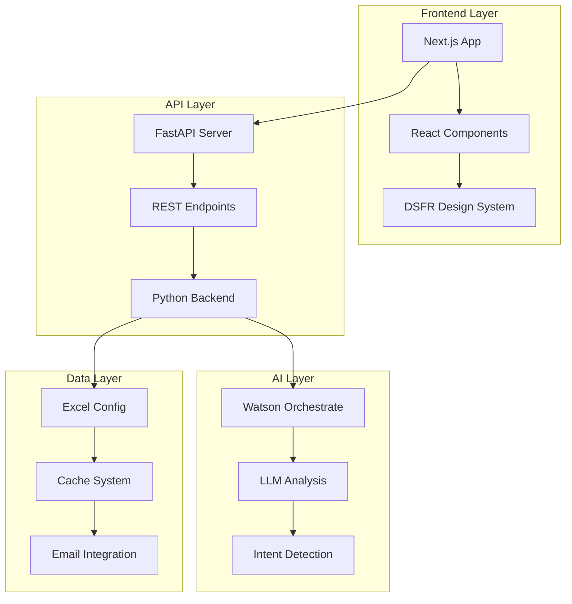
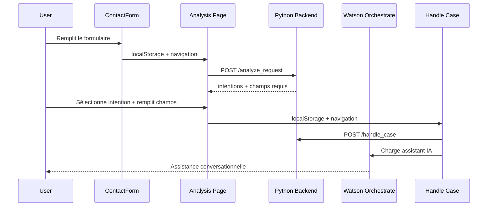

# Trusted Services - Plateforme IA pour Services Publics

[](https://nextjs.org/)
[](https://reactjs.org/)
[](https://python.org/)
[](https://fastapi.tiangolo.com/)
[](https://www.systeme-de-design.gouv.fr/)
[](https://typescriptlang.org/)

> 🏛️ **Plateforme intelligente pour l'automatisation et l'amélioration des services publics français**

Une solution complète combinant intelligence artificielle et design system gouvernemental pour moderniser l'accueil et le traitement des demandes citoyennes.

## 🚀 Aperçu du Projet

**Trusted Services** est une plateforme innovante qui transforme l'expérience des services publics en intégrant :

- **🤖 IA conversationnelle** avec Watson Orchestrate pour l'assistance citoyenne
- **📋 Analyse automatique** des demandes avec détection d'intentions
- **🎨 Interface moderne** conforme DSFR (Design System de l'État)
- **⚡ Performance optimisée** avec Next.js 15 et React 19
- **♿ Accessibilité RGAA** respectant les standards gouvernementaux

### 🎯 Cas d'usage : Préfecture des Yvelines (Delphes)

Le projet pilote modernise l'accueil des étrangers en préfecture avec :
- Formulaire intelligent de prise de rendez-vous
- Traitement automatique des demandes complexes
- Interface responsive multilingue (FR/EN)
- Intégration complète avec les systèmes existants

---

## 📋 Table des Matières

- [🚀 Démarrage Rapide](#-démarrage-rapide)
- [🏗️ Architecture](#️-architecture)
- [💻 Frontend Next.js](#-frontend-nextjs)
- [🤖 Intégration IA](#-intégration-ia)
- [🛠️ Installation](#️-installation)
- [⚙️ Configuration](#️-configuration)
- [🔧 API et Backend](#-api-et-backend)
- [📦 Déploiement](#-déploiement)
- [🌐 Localisation](#-localisation)
- [🔍 Débogage](#-débogage)
- [📚 Documentation](#-documentation)

---

## 🚀 Démarrage Rapide

### Mode Développement Complet

```bash
# 1. Cloner et installer
git clone <repository-url>
cd trusted-service

# 2. Backend Python
python -m venv .venv
source .venv/bin/activate  # ou .venv\Scripts\activate sur Windows
pip install -r requirements.txt

# 3. Frontend Next.js
cd apps/delphes/frontend
npm install

# 4. Lancer en parallèle
# Terminal 1 - API Backend
python launcher_api.py ./runtime

# Terminal 2 - Frontend Next.js
cd apps/delphes/frontend
npm run dev
```

🌐 **Accès** :
- Frontend : http://localhost:3000
- API Backend : http://localhost:8002
- Documentation API : http://localhost:8002/docs

### Mode Demo Streamlit (Legacy)

```bash
# Demo intégrée (client + serveur)
streamlit run launcher_testclient.py ./runtime direct

# Ou mode API REST
python launcher_api.py ./runtime
streamlit run launcher_testclient.py ./runtime rest
```

---

## 🏗️ Architecture



### Structure du Projet

```
trusted-service/
├── 🎨 apps/delphes/frontend/     # Frontend Next.js moderne
│   ├── src/app/                  # Pages et composants React
│   ├── public/                   # Assets statiques
│   └── package.json              # Dépendances Node.js
├── 🔧 src/                       # Backend Python
│   ├── backend/                  # API FastAPI
│   ├── client/                   # Clients API
│   ├── common/                   # Utilitaires partagés
│   └── text_analysis/            # Moteur IA
├── 🗃️ runtime/                   # Configuration et données
│   ├── config_*.yaml            # Configurations serveur
│   ├── apps/                     # Apps métier (AISA, Delphes...)
│   └── cache/                    # Cache des analyses
└── 📋 requirements.txt           # Dépendances Python
```
---

## 💻 Frontend Next.js

### 🎨 Interface Moderne DSFR

Le frontend Next.js offre une expérience utilisateur moderne tout en respectant les standards gouvernementaux français.

#### 🔧 Technologies

- **Framework** : Next.js 15.5.4 avec Turbopack
- **UI Library** : React 19.1.0 avec TypeScript 5.0+
- **Design System** : DSFR 1.14.2 (@gouvfr/dsfr)
- **Composants** : @codegouvfr/react-dsfr 1.28.0
- **HTTP Client** : Axios 1.12.2 avec SWR 2.3.6
- **Styles** : TailwindCSS 4.0+ intégré

#### 🚀 Fonctionnalités Clés

- ✅ **Formulaire intelligent** avec validation temps réel
- ✅ **Analyse IA des demandes** avec détection d'intentions automatique
- ✅ **Champs conditionnels** qui s'adaptent selon le type de demande
- ✅ **Conversion de dates** française (JJ/MM/AAAA) ↔ ISO (AAAA-MM-JJ)
- ✅ **Interface responsive** optimisée mobile/desktop
- ✅ **Watson Orchestrate** intégré pour assistance IA
- ✅ **Accessibilité RGAA** conforme standards gouvernementaux
- ✅ **Gestion d'état** localStorage pour flux multi-pages
- ✅ **API Proxy** transparent vers backend Python

#### 📁 Structure Frontend

```
apps/delphes/frontend/src/
├── app/
│   ├── page.tsx                    # 🏠 Page d'accueil avec redirection
│   ├── accueil-etrangers/
│   │   └── page.tsx               # 📝 Formulaire de contact principal
│   ├── analysis/
│   │   └── page.tsx               # 🤖 Page d'analyse IA avec champs dynamiques
│   ├── handle-case/
│   │   └── page.tsx               # 💼 Traitement du dossier + Watson Orchestrate
│   ├── confirmation/
│   │   └── page.tsx               # ✅ Page de confirmation
│   ├── api/[...path]/
│   │   └── route.ts               # 🔗 Proxy API vers backend Python
│   ├── globals.css                # 🎨 Styles globaux DSFR
│   └── layout.tsx                 # 📐 Layout principal de l'application
├── components/
│   ├── ContactForm.tsx            # 📋 Composant formulaire réutilisable
│   ├── Header.tsx                 # 🎯 En-tête gouvernemental DSFR
│   ├── Footer.tsx                 # 📄 Pied de page avec liens utiles
│   └── Spinner.css               # ⏳ Animation de chargement
└── utils/
    ├── convertDateToISO.ts        # 🗓️ Conversion date FR → ISO
    └── convertISOToDate.ts        # 🗓️ Conversion date ISO → FR
```

#### 🔄 Flux de Données



---

## 🤖 Intégration IA

### Watson Orchestrate

Le chatbot Watson Orchestrate est intégré dans la page `handle-case` pour fournir une assistance IA contextuelle.

#### Configuration

```typescript
// Configuration Watson dans handle-case/page.tsx
const wxOConfiguration = {
    orchestrationID: "0781f29958be4f588e177e1250f85e99_b50c4815-0abc-4da6-a4e0-c6371abd1ebc",
    hostURL: "https://us-south.watson-orchestrate.cloud.ibm.com",
    rootElementID: "watson-chat-container", // ⚠️ Évite conflit avec React
    deploymentPlatform: "ibmcloud",
    chatOptions: {
        agentId: "8d6b5494-1d0e-4170-aad5-a6dba46337f7"
    }
};
```

#### Fonctionnalités IA

- **🎯 Détection d'intentions** : Classification automatique des demandes
- **📝 Champs dynamiques** : Génération de formulaires adaptatifs
- **🗓️ Parsing de dates** : Reconnaissance intelligente de formats temporels
- **✅ Validation contextuelle** : Vérification des données selon l'intention
- **💬 Assistance conversationnelle** : Support utilisateur en temps réel

### Backend Text Analysis

```python
# Moteur d'analyse dans src/text_analysis/
├── llm_ollama.py          # Interface Ollama locale
├── llm_openai.py          # Interface OpenAI/Azure
├── base_models.py         # Modèles de données
└── text_analysis_localization.py  # Support multilingue
```

---

## 🛠️ Installation

### Prérequis

- **Python** 3.11+ avec pip
- **Node.js** 18+ avec npm
- **Git** pour le versioning

### Installation Backend

```bash
# Environnement virtuel Python
python -m venv .venv
source .venv/bin/activate  # Linux/macOS
# .venv\Scripts\activate   # Windows

# Dépendances Python
pip install -r requirements.txt

# Vérification
python -c "import fastapi, uvicorn; print('✅ Backend ready')"
```

### Installation Frontend

```bash
# Navigation vers frontend
cd apps/delphes/frontend

# Installation dépendances
npm install

# Vérification
npm run build
echo "✅ Frontend ready"
```

### Variables d'Environnement

Créer `.env.local` dans `apps/delphes/frontend/` :

```env
# API Configuration
NEXT_PUBLIC_API_BASE_URL=http://localhost:8002

# Watson Orchestrate (optionnel)
NEXT_PUBLIC_WATSON_ORCHESTRATION_ID=your_orchestration_id
NEXT_PUBLIC_WATSON_HOST_URL=https://us-south.watson-orchestrate.cloud.ibm.com

# Environment
NODE_ENV=development
```

---

## ⚙️ Configuration

### Configuration Runtime

Le système utilise des fichiers YAML pour la configuration :

```yaml
# runtime/config_server.yaml
server:
  host: "127.0.0.1"
  port: 8002
  reload: true

# runtime/config_connection.yaml
llm_providers:
  openai:
    api_key: "your_api_key"
    model: "gpt-4"
  ollama:
    base_url: "http://localhost:11434"
    model: "llama2"
```

### Configuration Applications

Chaque application a sa configuration Excel dans `runtime/apps/` :

```
runtime/apps/
├── delphes/
│   ├── delphes.xlsx        # Configuration métier
│   ├── data_enrichment.py  # Enrichissement données
│   └── decision_engine.py  # Moteur de décision
├── AISA/
│   └── AISA.xlsx          # Application AISA
└── conneXion/
    └── conneXion.xlsx     # Application ConneXion
```

### Structure Excel

Les fichiers Excel définissent :
- **Intentions** : Types de demandes supportées
- **Champs** : Données requises par intention
- **Localisations** : Traductions FR/EN
- **Workflows** : Processus de traitement
- **Emails** : Templates de notification

---

## 🔧 API et Backend

### Architecture FastAPI

```python
# src/backend/app.py - Point d'entrée principal
from fastapi import FastAPI
from src.backend.rest import router

app = FastAPI(
    title="Trusted Services API",
    description="API pour services publics intelligents",
    version="1.0.0"
)

app.include_router(router, prefix="/api")
```

### Endpoints Principaux

| Endpoint | Méthode | Description |
|----------|---------|-------------|
| `/api/analyze_request` | POST | Analyse IA d'une demande |
| `/api/handle_case` | POST | Traitement complet d'un dossier |
| `/api/get_intentions` | GET | Liste des intentions disponibles |
| `/api/health` | GET | Statut de l'API |
| `/docs` | GET | Documentation Swagger |

### Exemples d'utilisation

```bash
# Analyse d'une demande
curl -X POST "http://localhost:8002/api/analyze_request" \
  -H "Content-Type: application/json" \
  -d '{
    "app_name": "delphes",
    "locale": "fr",
    "message": "Je souhaite renouveler mon titre de séjour"
  }'

# Traitement d'un dossier
curl -X POST "http://localhost:8002/api/handle_case" \
  -H "Content-Type: application/json" \
  -d '{
    "app_name": "delphes",
    "locale": "fr",
    "field_values": {
      "nom": "Dupont",
      "prenom": "Jean",
      "date_naissance": "1990-01-15"
    },
    "selected_intention": "renouvellement_titre_sejour"
  }'
```

---

## 📦 Déploiement

### Mode Production

```bash
# Build Frontend
cd apps/delphes/frontend
npm run build
npm run start  # Port 3000

# Backend Production
uvicorn src.backend.app:app \
  --host 0.0.0.0 \
  --port 8002 \
  --workers 4
```

### Docker (Recommandé)

```dockerfile
# Dockerfile.frontend
FROM node:18-alpine
WORKDIR /app
COPY package*.json ./
RUN npm ci --only=production
COPY . .
RUN npm run build
EXPOSE 3000
CMD ["npm", "start"]
```

```dockerfile
# Dockerfile.backend
FROM python:3.11-slim
WORKDIR /app
COPY requirements.txt .
RUN pip install --no-cache-dir -r requirements.txt
COPY . .
EXPOSE 8002
CMD ["uvicorn", "src.backend.app:app", "--host", "0.0.0.0", "--port", "8002"]
```

```yaml
# docker-compose.yml
version: '3.8'
services:
  frontend:
    build:
      context: ./apps/delphes/frontend
      dockerfile: Dockerfile
    ports:
      - "3000:3000"
    environment:
      - NEXT_PUBLIC_API_BASE_URL=http://backend:8002
    depends_on:
      - backend

  backend:
    build:
      context: .
      dockerfile: Dockerfile.backend
    ports:
      - "8002:8002"
    volumes:
      - ./runtime:/app/runtime
    environment:
      - PYTHON_PATH=/app
```

### Nginx Configuration

```nginx
# /etc/nginx/sites-available/trusted-services
server {
    listen 80;
    server_name your-domain.gouv.fr;

    # Frontend Next.js
    location / {
        proxy_pass http://localhost:3000;
        proxy_set_header Host $host;
        proxy_set_header X-Real-IP $remote_addr;
    }

    # API Backend
    location /api/ {
        proxy_pass http://localhost:8002;
        proxy_set_header Host $host;
        proxy_set_header X-Real-IP $remote_addr;
    }

    # Assets statiques
    location /static/ {
        alias /var/www/trusted-services/static/;
        expires 1y;
        add_header Cache-Control "public, immutable";
    }
}
```

---

## 🌐 Localisation

### Support Multilingue

Le système supporte actuellement :
- 🇫🇷 **Français** (`fr`) - Langue principale
- 🇬🇧 **Anglais** (`en`) - Traduction complète

### Ajouter une Nouvelle Langue

Pour ajouter le support d'une nouvelle langue (ex: `es` pour l'espagnol) :

#### 1. Mise à jour du code Python

```python
# src/common/configuration.py
class SupportedLocale(str, Enum):
    fr = "fr"
    en = "en"
    es = "es"  # ← Ajouter ici

# src/backend/text_analysis/text_analysis_localization.py
# IF YOU CHANGE THE FOLLOWING COMMENT, UPDATE README.md ACCORDINGLY
# Add here support for new languages
SUPPORTED_LOCALES = ["fr", "en", "es"]  # ← Ajouter ici
```

#### 2. Configuration Excel

Dans `runtime/apps/delphes/delphes.xlsx` :
- Dupliquer les colonnes `*_fr` en `*_es`
- Traduire le contenu avec un LLM
- Conserver les noms officiels sans traduction

#### 3. Frontend Next.js

```typescript
// src/app/layout.tsx
const locales = ['fr', 'en', 'es'];  // ← Ajouter ici

// Créer les fichiers de traduction
// locales/es.json
{
  "contact_form": {
    "title": "Formulario de contacto",
    "submit": "Enviar"
  }
}
```

### Bonnes Pratiques

- ✅ Utiliser un LLM pour les traductions avec contexte métier
- ✅ Conserver les termes officiels (ex: "AES: admission exceptionnelle au séjour")
- ✅ Tester chaque langue sur tous les parcours utilisateur
- ✅ Éviter les underscores dans les codes langue

---

## 🔍 Débogage

### Logs et Monitoring

```bash
# Logs Backend détaillés
python launcher_api.py ./runtime --log-level debug

# Logs Frontend Next.js
cd apps/delphes/frontend
npm run dev  # Mode verbose automatique

# Logs Watson Orchestrate
# Vérifier la console navigateur pour les erreurs de script
```

### Problèmes Courants

#### 🚨 Erreur "Minified React error #321"

**Cause** : Conflit d'ID entre React et Watson Orchestrate

**Solution** : Vérifier que `rootElementID` dans Watson config utilise un ID unique (pas "root")

```typescript
// ❌ Incorrect
rootElementID: "root"  // Conflit avec React

// ✅ Correct  
rootElementID: "watson-chat-container"
```

#### 🚨 CORS Error sur API

**Cause** : Configuration CORS manquante

**Solution** : Vérifier la configuration FastAPI

```python
# src/backend/app.py
from fastapi.middleware.cors import CORSMiddleware

app.add_middleware(
    CORSMiddleware,
    allow_origins=["http://localhost:3000"],
    allow_methods=["*"],
    allow_headers=["*"],
)
```

#### 🚨 Champs de formulaire non remplis

**Cause** : Mismatch entre noms de champs backend/frontend

**Solution** : Vérifier la correspondance dans `ContactForm.tsx`

```typescript
// Mapping des noms de champs
const fieldMapping = {
  'date_naissance': 'dateNaissance',
  'situation_familiale': 'situationFamiliale',
  // etc...
};
```

#### 🚨 Watson Orchestrate ne se charge pas

**Causes possibles** :
- Script bloqué par politique CSP
- ID container introuvable
- Configuration incorrecte

**Diagnostic** :
```javascript
// Console navigateur
console.log(window.wxOConfiguration);
console.log(document.getElementById('watson-chat-container'));
```

### Outils de Debug

```bash
# Vérification de l'état des services
curl http://localhost:8002/api/health
curl http://localhost:3000/api/health

# Test des endpoints API
curl -X POST http://localhost:8002/api/analyze_request \
  -H "Content-Type: application/json" \
  -d '{"app_name":"delphes","locale":"fr","message":"test"}'

# Validation des configurations
python -c "
import yaml
with open('runtime/config_server.yaml') as f:
    print(yaml.safe_load(f))
"
```

---

## 📚 Documentation

### Ressources Supplémentaires

- **[Frontend README](apps/delphes/frontend/README.md)** - Documentation Next.js spécifique
- **[Delphes README](apps/delphes/README.md)** - Documentation application métier
- **[ODM README](src/backend/decision/decision_odm/README.md)** - Moteur de décision

### Standards et Références

- **[DSFR Documentation](https://www.systeme-de-design.gouv.fr/)** - Design System gouvernemental
- **[RGAA Guidelines](https://accessibilite.numerique.gouv.fr/)** - Accessibilité numérique
- **[Next.js Docs](https://nextjs.org/docs)** - Framework React
- **[FastAPI Docs](https://fastapi.tiangolo.com/)** - API Python moderne

### APIs Externes

- **[Watson Orchestrate](https://www.ibm.com/cloud/watson-orchestrate)** - Plateforme IA IBM
- **[OpenAI API](https://platform.openai.com/docs)** - Modèles de langage
- **[Ollama](https://ollama.ai/)** - LLM local

---

## 👥 Contribution

### Workflow Git

```bash
# Créer une branche feature
git checkout -b feature/nouvelle-fonctionnalite

# Développement avec commits atomiques
git add .
git commit -m "feat: ajouter fonction X"

# Push et Pull Request
git push origin feature/nouvelle-fonctionnalite
# Créer PR sur GitHub
```

### Standards de Code

- **Python** : Black, isort, mypy
- **TypeScript** : ESLint, Prettier
- **Commits** : Convention [Conventional Commits](https://conventionalcommits.org/)

### Tests

```bash
# Tests Backend
python -m pytest src/tests/

# Tests Frontend  
cd apps/delphes/frontend
npm run test

# Tests E2E
npm run test:e2e
```

---

## 📄 Licence

Ce projet est sous licence propriétaire Athena. Tous droits réservés.

---

## 📞 Support

Pour toute question ou problème :

1. **Issues GitHub** : Créer un ticket détaillé
2. **Documentation** : Consulter les README spécifiques
3. **Logs** : Joindre les logs d'erreur complets
4. **Contact** : équipe-dev@athena.fr

---

*Dernière mise à jour : 3 octobre 2025*

#### Avantages vs ancien site statique
- **Maintenabilité** : Code modulaire TypeScript vs HTML mélangé
- **Performance** : Rendu optimisé Next.js vs pages statiques lourdes  
- **UX** : Validation temps réel vs validation côté serveur uniquement
- **Évolutivité** : Composants réutilisables vs code dupliqué
- **Tests** : Structure testable vs difficilement testable

Pour plus de détails, consultez le [README frontend](apps/delphes/frontend/README.md).

