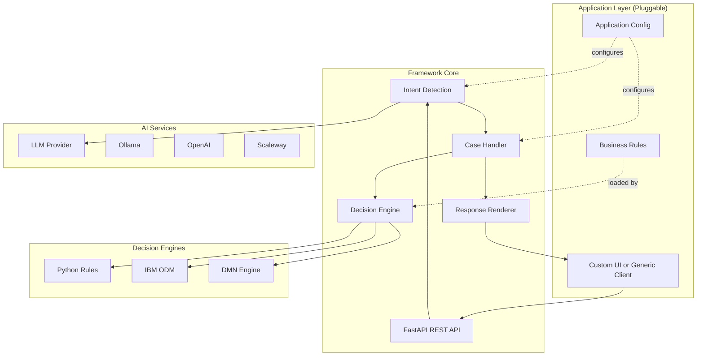
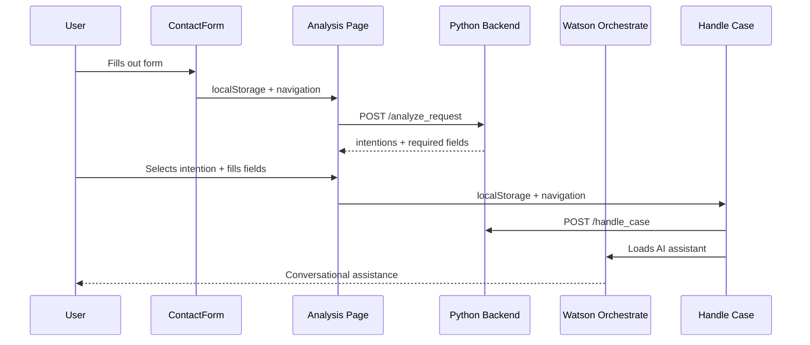

# Trusted Services - AI Framework for Public Services

[](https://python.org/)
[](https://fastapi.tiangolo.com/)
[](https://streamlit.io/)
[](https://docker.com/)

> 🏛️ **Generic AI framework for building intelligent public service applications**

## 🌟 What is Trusted Services?

**Trusted Services** is a **generic framework** that enables rapid development of AI-powered public service applications. It combines:

- **🤖 AI-Powered Intent Detection**: Analyze user requests and automatically determine their intent
- **📋 Intelligent Case Handling**: Route and process cases using configurable business rules
- **🔧 Decision Engine Integration**: Support for ODM, DMN, and Python-based decision engines
- **🌍 Multi-language Support**: Built-in localization for English, French, Finnish, and more
- **🎯 Application-Agnostic**: Build any public service application on top of the framework

### Framework vs Applications

```
┌─────────────────────────────────────────────┐
│      Trusted Services Framework             │
│  (Backend + Generic Test Client)            │
│  - Intent detection                         │
│  - Case handling                            │
│  - Decision engine integration              │
│  - Multi-language support                   │
└─────────────────────────────────────────────┘
                    ▲
                    │
        ┌───────────┼───────────┐
        │           │           │
    ┌───▼───┐   ┌───▼───┐   ┌──▼────┐
    │Delphes│   │ AISA  │   │conneX.│
    │🇫🇷     │   │ 🇫🇮    │   │ 🧪    │
    └───────┘   └───────┘   └───────┘
   Prefecture   Helsinki    Telecom
     System      Services   Test App
```

## 📦 Applications Built on Trusted Services

### 🇫🇷 Delphes - French Prefecture System
**Production application** modernizing reception at French prefectures
- Custom Next.js frontend (French design system compliant)
- Handles foreign nationals' residence permit requests
- Multilingual support (French/English)
- [See Delphes Documentation](apps/delphes/README.md)

### 🇫🇮 AISA - Helsinki City Services
**In development** for Helsinki city government
- Uses generic Streamlit test client (custom frontend planned)
- Finnish and English language support
- [See APPLICATIONS.md](APPLICATIONS.md) for details

### 🧪 conneXion - Telecom Test Application
**Test application** for fictional telecom operator customer service
- Uses generic test client
- Validates framework capabilities
- [See APPLICATIONS.md](APPLICATIONS.md) for details

**Want to build your own application?** See [APPLICATIONS.md](APPLICATIONS.md) for the application catalog and development guide.

---

## 📋 Table of Contents

- [🚀 Quick Start](#-quick-start)
  - [Framework Development](#framework-development-docker-recommended)
  - [Running Applications](#running-applications)
  - [Manual Setup](#manual-setup-no-docker)
- [🏗️ Architecture](#️-architecture)
- [📦 Applications](#-applications)
- [🛠️ Installation](#️-installation)
- [⚙️ Configuration](#️-configuration)
- [🔧 API and Backend](#-api-and-backend)
- [🧪 Testing](#-testing)
- [📦 Deployment](#-deployment)
- [🌐 Localization](#-localization)
- [🔍 Debugging](#-debugging)
- [📚 Documentation](#-documentation)

---

## 🔄 Recent Updates

- Added validation for required case fields before hitting decision engines and explicit errors when no distribution engine is configured.
- Cache and live analysis responses now both include the fallback “other” intention for consistent payloads.
- New unit tests protect `handle_case` against missing fields and missing distribution engines.

---

## 🚧 Known Issues

The canonical list of issues is tracked on GitHub: https://github.com/athena-ceo/trusted-service/issues

Highlighted open issues:
- #28: Add an attachment based on the selected intent — https://github.com/athena-ceo/trusted-service/issues/28
- #27: Keep a log of requests and decisions to enable stats — https://github.com/athena-ceo/trusted-service/issues/27
- #26: Expose detected user intents to the agent — https://github.com/athena-ceo/trusted-service/issues/26
- #25: Accept messages written in a different language — https://github.com/athena-ceo/trusted-service/issues/25
- #24: Manage language dependent email address — https://github.com/athena-ceo/trusted-service/issues/24
- #12: Add support for DMN rule engines — https://github.com/athena-ceo/trusted-service/issues/12
- #9: Use Docker Compose with separate containers for backend and frontend — https://github.com/athena-ceo/trusted-service/issues/9
- #17: Create environment-specific configuration — https://github.com/athena-ceo/trusted-service/issues/17
- #18: Replace Excel-based configuration with more standard approach — https://github.com/athena-ceo/trusted-service/issues/18
- #6: Add smoke tests in GitHub Actions to detect issues on each commit — https://github.com/athena-ceo/trusted-service/issues/6
- #15: Automated LLM tests — https://github.com/athena-ceo/trusted-service/issues/15
- #1: Add logging and improve error management — https://github.com/athena-ceo/trusted-service/issues/1
 - #29: Safeguard get_app_name() when app_id is missing — https://github.com/athena-ceo/trusted-service/issues/29
 - #30: Strengthen cache key and unify cache paths — https://github.com/athena-ceo/trusted-service/issues/30
 - #31: Add ticketing/webhook distribution engines — https://github.com/athena-ceo/trusted-service/issues/31
 - #32: Document and harden runtime import alias — https://github.com/athena-ceo/trusted-service/issues/32

Additional technical observations (not yet filed or to be refined):
- API error exposure: `/analyze` currently returns full tracebacks to clients; harden by returning generic errors while logging details server-side. See [src/backend/backend/rest/main.py](src/backend/backend/rest/main.py).
- CORS policy: `allow_origins=["*"]` is permissive; restrict to allowed frontends in production. See [src/backend/backend/rest/main.py](src/backend/backend/rest/main.py).
- `get_app_name()` error handling: ensure safe behavior when `app_id` is missing. See [src/backend/backend/trusted_services_server.py](src/backend/backend/trusted_services_server.py).
- Cache key collisions: `short_hash()` truncated to 6 chars increases collision risk; consider 10–12+ chars and include `llm_config.id`. See [src/backend/backend/paths.py](src/backend/backend/paths.py).
- Duplicate cache paths: `get_cache_file_path` vs `get_cache_file_path2`; unify the strategy and location. See [src/backend/backend/paths.py](src/backend/backend/paths.py).
- Logging: basic global logging without rotation/JSON; add rotation and per-module levels. See [src/backend/backend/trusted_services_server.py](src/backend/backend/trusted_services_server.py).
- Distribution engines: only email implemented; plan ticketing/webhook interfaces with timeouts and async retries. See [src/backend/distribution](src/backend/distribution).
- Runtime import alias: dynamic `runtime` alias for `uvicorn --reload`; document and harden import resolution. See [src/backend/backend/rest/main.py](src/backend/backend/rest/main.py).
- Field validation: enforce `mandatory` case fields consistently at API/UI boundaries. See [src/common/case_model.py](src/common/case_model.py).
- Token accounting: implement token counts for observability across LLMs. See [src/backend/text_analysis/text_analyzer.py](src/backend/text_analysis/text_analyzer.py).

If helpful, we can open/refine GitHub issues for the observations above and prioritize them.

CI guard: The repository includes an automated check that validates this section stays coherent with GitHub (see .github/workflows/known-issues-check.yml). The job ensures all referenced issues exist, are open, and that links match the numbers.

## 🏷️ Issue Labels Guide

Use labels consistently to keep issue triage clear and actionable:
- security: Security-related hardening (e.g., CORS restrictions, hiding server tracebacks). Typically paired with `enhancement` or `bug`.
- observability: Telemetry, metrics, logging, and traces (e.g., token accounting in analysis stats). Usually paired with `enhancement`.
- enhancement: New capability or improvement to existing functionality.
- bug: Defect leading to incorrect behavior or crashes.
- documentation: README and docs changes, examples, configuration guides.
- help wanted: Contributions welcome; community support appreciated.
- question: Clarification or design discussion needed before implementation.

Guidelines:
- Combine one functional label (e.g., `enhancement` or `bug`) with category labels (`security`, `observability`, `documentation`) when relevant.
- Keep titles action-oriented; include Problem, Proposal, and Acceptance criteria in the issue body.
- Examples:
  - #29: Safeguard `get_app_name()` when `app_id` is missing → bug (+ optionally security if exposure is a concern).
  - #30: Strengthen cache key and unify cache paths → enhancement (+ optionally observability for tracing collisions).
  - #31: Add ticketing/webhook distribution engines → enhancement.
  - #32: Document and harden runtime import alias → documentation + enhancement.

## 🚀 Quick Start

The simplest option to check the framework is the integrated demo (client + in-process server) which runs the test/demo client and the Trusted Services server in the same process.
`streamlit run launcher_testclient.py ./runtime direct`

Choose your path: develop the framework, run an existing application, or build a new one.

### Framework Development (Docker - Recommended)

**Start the framework with generic test client:**

```bash
# Clone repository
git clone <repository-url>
cd trusted-service

# Start framework with Streamlit test client
./docker-manage.sh start framework

# Or just the backend
./docker-manage.sh start framework prod
```

🌐 **Access**:
- **Backend API**: http://localhost:8002
- **Generic Test Client**: http://localhost:8501  
- **API Docs**: http://localhost:8002/docs
- **Health Check**: http://localhost:8002/api/health

**Test all applications:**
The generic test client lets you test any application (Delphes, AISA, conneXion) without needing their custom frontends.

### Running Applications

#### Option 1: Delphes Application (French Prefecture)
```bash
# Full Delphes stack: Backend + Custom Next.js Frontend
./docker-manage.sh start delphes

# Access at:
#  - Frontend: http://localhost:3000
#  - Backend:  http://localhost:8002
```

#### Option 2: AISA Application (Helsinki City)
```bash
# AISA uses the framework test client (for now)
./docker-manage.sh start aisa

# Access at:
#  - Test Client: http://localhost:8501
#  - Backend:     http://localhost:8002
```

#### Option 3: conneXion (Telecom Test App)
```bash
# Test application for validation
./docker-manage.sh start connexion

# Access at:
#  - Test Client: http://localhost:8501
#  - Backend:     http://localhost:8002
```

**List all available applications:**
```bash
./docker-manage.sh list-apps
```

### Docker Commands Reference

```bash
# Basic commands
./docker-manage.sh start [app] [env]    # Start services
./docker-manage.sh stop [app]           # Stop services
./docker-manage.sh status [app]         # Check status
./docker-manage.sh logs [app]           # View logs
./docker-manage.sh shell [app]          # Backend shell

# Build commands
./docker-manage.sh build [app]          # Build images
./docker-manage.sh rebuild [app]        # Rebuild from scratch
./docker-manage.sh clean [app]          # Remove all (⚠️ includes volumes)

# Targets: framework, delphes, aisa, connexion
# Environments: dev (default), prod
```

**Examples:**
```bash
./docker-manage.sh start framework      # Framework + test client
./docker-manage.sh start delphes        # Delphes full stack
./docker-manage.sh logs delphes         # View Delphes logs
./docker-manage.sh rebuild framework    # Clean framework rebuild
```

### Manual Setup (No Docker)

**Framework Backend:**
```bash
# 1. Setup Python environment
python -m venv tsvenv
source tsvenv/bin/activate  # Windows: tsvenv\Scripts\activate
pip install -r requirements.txt

# 2. Start backend
python launcher_api.py ./runtime

# Backend runs at: http://localhost:8002
```

**Generic Test Client:**
```bash
# With backend running, in another terminal:
source tsvenv/bin/activate
streamlit run launcher_testclient.py ./runtime rest

# Test client at: http://localhost:8501
```

**Delphes Frontend (separate):**
```bash
# 1. Install Node dependencies
cd apps/delphes/frontend
npm install

# 2. Start Next.js dev server
npm run dev

# Frontend at: http://localhost:3000
```

### What to Run?

| **Goal** | **Command** | **What You Get** |
|----------|-------------|------------------|
| Test framework features | `./docker-manage.sh start framework` | Backend + Generic test client |
| Run Delphes in production-like mode | `./docker-manage.sh start delphes` | Full Delphes stack |
| Develop on AISA | `./docker-manage.sh start aisa` | Backend + Test client for AISA |
| Framework backend only | `./docker-manage.sh start framework prod` | Just backend (for remote frontends) |
| Build new application | See [APPLICATIONS.md](APPLICATIONS.md) | Development guide |

---

## 🏗️ Architecture

### Framework Architecture

The Trusted Services framework provides the core infrastructure that applications extend:



### Project Structure

```
trusted-service/
├── 📁 src/                       # ⭐ FRAMEWORK CODE
│   ├── backend/
│   │   ├── backend/
│   │   │   ├── app.py           # Core FastAPI application
│   │   │   ├── rest/            # REST API endpoints
│   │   │   ├── localized_app.py # Localized app manager
│   │   │   └── server_config.py # Configuration loader
│   │   ├── decision/            # Decision engine integrations
│   │   │   ├── decision.py      # Base decision interface
│   │   │   ├── decision_dmoe/   # Python-based rules
│   │   │   └── decision_odm/    # IBM ODM integration
│   │   ├── distribution/        # Output distribution (email, etc.)
│   │   ├── rendering/           # Response rendering (HTML, MD)
│   │   └── text_analysis/       # AI/LLM integration
│   ├── client/                  # API client libraries
│   └── common/                  # Shared utilities
│
├── 📁 apps/                      # ⭐ APPLICATIONS
│   ├── delphes/                 # French Prefecture app
│   │   ├── frontend/            # Custom Next.js UI
│   │   ├── docker-compose.dev.yml
│   │   └── docker-compose.prod.yml
│   ├── (future: aisa/, connexion/)
│
├── 📁 runtime/                   # ⭐ RUNTIME CONFIGURATION
│   ├── apps/                    # Application-specific configs
│   │   ├── AISA/               # Helsinki city services
│   │   │   ├── AISA.xlsx       # Intent/field definitions
│   │   │   └── decision_engine.py
│   │   ├── delphes/            # Prefecture config
│   │   │   ├── delphes.xlsx
│   │   │   └── decision_engine.py
│   │   └── conneXion/          # Telecom test app
│   ├── cache/                  # LLM response cache
│   ├── config_server.yaml      # Server settings
│   └── config_connection.yaml  # API connection settings
│
├── 📁 tests/                     # Test suites
│   ├── smoke/                   # Smoke tests
│   ├── integration/             # Integration tests
│   └── unit/                    # Unit tests
│
├── 📁 .github/workflows/         # CI/CD pipelines
│
├── 🐳 Docker files (Framework)
│   ├── Dockerfile.backend       # Backend container
│   ├── Dockerfile.streamlit     # Generic test client
│   ├── docker-compose.yml       # Backend only
│   ├── docker-compose.dev.yml   # Backend + test client
│   └── docker-compose.prod.yml  # Production backend
│
├── 🔧 Management scripts
│   ├── docker-manage.sh         # Multi-app Docker manager
│   ├── launcher_api.py          # Backend launcher
│   └── launcher_testclient.py   # Streamlit test client
│
└── 📋 Configuration
    ├── requirements.txt         # Python dependencies
    ├── Makefile                 # Development commands
    └── TODO.md                  # Project roadmap
```

### Key Design Principles

1. **Framework is Application-Agnostic**: Core code in `src/` has zero application-specific logic
2. **Applications are Pluggable**: Each app in `runtime/apps/` is self-contained with its config
3. **Flexible UI**: Apps can use the generic test client or build custom frontends
4. **Multiple Decision Engines**: Support Python, ODM, DMN based on app needs
5. **Easy Testing**: Generic client allows testing any app without custom UI

---

## 📦 Applications

The Trusted Services framework powers multiple public service applications. Each application is self-contained with its own configuration, business rules, and optionally a custom frontend.

### Current Applications

| Application | Status | Frontend | Description | Documentation |
|-------------|--------|----------|-------------|---------------|
| **Delphes 🇫🇷** | Production | Custom Next.js | French prefecture reception system | [apps/delphes/README.md](apps/delphes/README.md) |
| **AISA 🇫🇮** | In Development | Generic Test Client | Helsinki city government services | [APPLICATIONS.md](APPLICATIONS.md) |
| **conneXion 🧪** | Test/Demo | Generic Test Client | Telecom operator customer service | [APPLICATIONS.md](APPLICATIONS.md) |

### Application Structure

Each application consists of:

```
runtime/apps/{app_name}/
├── {app_name}.xlsx         # Intent definitions and fields
├── decision_engine.py      # Business rules (Python)
└── (optional) other configs

apps/{app_name}/            # Optional: custom frontend
├── frontend/
├── docker-compose.dev.yml
└── docker-compose.prod.yml
```

### Building Your Own Application

See [APPLICATIONS.md](APPLICATIONS.md) for:
- Complete application catalog
- Development guide for new applications
- API integration examples
- Configuration reference

---

## 💻 Delphes Frontend (Example Application)

### 🎨 Modern DSFR Interface

**Note**: This section describes the Delphes-specific Next.js frontend. Other applications (AISA, conneXion) currently use the generic Streamlit test client.

The Next.js frontend offers a modern user experience while respecting French government standards.

#### 🔧 Technologies

- **Framework**: Next.js 15.5.4 with Turbopack
- **UI Library**: React 19.1.0 with TypeScript 5.0+
- **Design System**: DSFR 1.14.2 (@gouvfr/dsfr)
- **Components**: @codegouvfr/react-dsfr 1.28.0
- **HTTP Client**: Axios 1.12.2 with SWR 2.3.6
- **Styles**: TailwindCSS 4.0+ integrated

#### 🚀 Key Features

- ✅ **Intelligent form** with real-time validation
- ✅ **AI request analysis** with automatic intent detection
- ✅ **Conditional fields** that adapt according to request type
- ✅ **Date conversion** French (DD/MM/YYYY) ↔ ISO (YYYY-MM-DD)
- ✅ **Responsive interface** optimized for mobile/desktop
- ✅ **Watson Orchestrate** integrated for AI assistance
- ✅ **RGAA accessibility** compliant with government standards
- ✅ **State management** localStorage for multi-page flows
- ✅ **API Proxy** transparent to Python backend

#### 📁 Frontend Structure

```
apps/delphes/frontend/src/
├── app/
│   ├── page.tsx                    # 🏠 Home page with redirect
│   ├── accueil-etrangers/
│   │   └── page.tsx               # 📝 Main contact form
│   ├── analysis/
│   │   └── page.tsx               # 🤖 AI analysis page with dynamic fields
│   ├── handle-case/
│   │   └── page.tsx               # 💼 Case processing + Watson Orchestrate
│   ├── confirmation/
│   │   └── page.tsx               # ✅ Confirmation page
│   ├── api/[...path]/
│   │   └── route.ts               # 🔗 API proxy to Python backend
│   ├── globals.css                # 🎨 Global DSFR styles
│   └── layout.tsx                 # 📐 Main application layout
├── components/
│   ├── ContactForm.tsx            # 📋 Reusable form component
│   ├── Header.tsx                 # 🎯 Government DSFR header
│   ├── Footer.tsx                 # 📄 Footer with useful links
│   └── Spinner.css               # ⏳ Loading animation
└── utils/
    ├── convertDateToISO.ts        # 🗓️ Date conversion FR → ISO
    └── convertISOToDate.ts        # 🗓️ Date conversion ISO → FR
```

#### 🔄 Data Flow



---

## 🤖 AI Integration

### Watson Orchestrate

The Watson Orchestrate chatbot is integrated in the `handle-case` page to provide contextual AI assistance.

#### Configuration

```typescript
// Watson configuration in handle-case/page.tsx
const wxOConfiguration = {
    orchestrationID: "0781f29958be4f588e177e1250f85e99_b50c4815-0abc-4da6-a4e0-c6371abd1ebc",
    hostURL: "https://us-south.watson-orchestrate.cloud.ibm.com",
    rootElementID: "watson-chat-container", // ⚠️ Avoids conflict with React
    deploymentPlatform: "ibmcloud",
    chatOptions: {
        agentId: "8d6b5494-1d0e-4170-aad5-a6dba46337f7"
    }
};
```

#### AI Features

- **🎯 Intent detection**: Automatic classification of requests
- **📝 Dynamic fields**: Adaptive form generation
- **🗓️ Date parsing**: Intelligent recognition of temporal formats
- **✅ Contextual validation**: Data verification according to intent
- **💬 Conversational assistance**: Real-time user support

### Backend Text Analysis

```python
# Analysis engine in src/text_analysis/
├── llm_ollama.py          # Local Ollama interface
├── llm_openai.py          # OpenAI/Azure interface
├── base_models.py         # Data models
└── text_analysis_localization.py  # Multilingual support
```

---

## 🛠️ Installation

### Prerequisites

- **Python** 3.11+ with pip
- **Node.js** 18+ with npm
- **Git** for versioning

### Backend Installation

```bash
# Python virtual environment
python -m venv .venv
source .venv/bin/activate  # Linux/macOS
# .venv\Scripts\activate   # Windows

# Python dependencies
pip install -r requirements.txt

# Verification
python -c "import fastapi, uvicorn; print('✅ Backend ready')"
```

### Frontend Installation

```bash
# Navigate to frontend
cd apps/delphes/frontend

# Install dependencies
npm install

# Verification
npm run build
echo "✅ Frontend ready"
```

### Environment Variables

Create `.env.local` in `apps/delphes/frontend/`:

```env
# API Configuration
NEXT_PUBLIC_API_BASE_URL=http://localhost:8002

# Watson Orchestrate (optional)
NEXT_PUBLIC_WATSON_ORCHESTRATION_ID=your_orchestration_id
NEXT_PUBLIC_WATSON_HOST_URL=https://us-south.watson-orchestrate.cloud.ibm.com

# Environment
NODE_ENV=development
```

---

## ⚙️ Configuration

### Runtime Configuration

The system uses YAML files for configuration:

```yaml
# runtime/config_server.yaml
server:
  host: "127.0.0.1"
  port: 8002
  reload: true

# runtime/config_connection.yaml
llm_providers:
  openai:
    api_key: "your_api_key"
    model: "gpt-4"
  ollama:
    base_url: "http://localhost:11434"
    model: "llama2"
```

### Application Configuration

Each application has its Excel configuration in `runtime/apps/`:

```
runtime/apps/
├── delphes/
│   ├── delphes.xlsx        # Business configuration
│   ├── data_enrichment.py  # Data enrichment
│   └── decision_engine.py  # Decision engine
├── AISA/
│   └── AISA.xlsx          # AISA application
└── conneXion/
    └── conneXion.xlsx     # ConneXion application
```

### Excel Structure

Excel files define:
- **Intentions**: Supported request types
- **Fields**: Required data per intention
- **Localizations**: FR/EN translations
- **Workflows**: Processing flows
- **Emails**: Notification templates

---

## 🔧 API and Backend

### FastAPI Architecture

```python
# src/backend/app.py - Main entry point
from fastapi import FastAPI
from src.backend.rest import router

app = FastAPI(
    title="Trusted Services API",
    description="API for intelligent public services",
    version="1.0.0"
)

app.include_router(router, prefix="/api")
```

### Main Endpoints

| Endpoint | Method | Description |
|----------|--------|-------------|
| `/api/analyze_request` | POST | AI analysis of a request |
| `/api/handle_case` | POST | Complete case processing |
| `/api/get_intentions` | GET | List of available intentions |
| `/api/health` | GET | API status |
| `/docs` | GET | Swagger documentation |

### Usage Examples

```bash
# Request analysis
curl -X POST "http://localhost:8002/api/analyze_request" \
  -H "Content-Type: application/json" \
  -d '{
    "app_name": "delphes",
    "locale": "fr",
    "message": "Je souhaite renouveler mon titre de séjour"
  }'

# Case processing
curl -X POST "http://localhost:8002/api/handle_case" \
  -H "Content-Type: application/json" \
  -d '{
    "app_name": "delphes",
    "locale": "fr",
    "field_values": {
      "nom": "Dupont",
      "prenom": "Jean",
      "date_naissance": "1990-01-15"
    },
    "selected_intention": "renouvellement_titre_sejour"
  }'
```

---

## 🧪 Testing

### Quick Start

```bash
# Install test dependencies
pip install -r tests/requirements.txt
playwright install chromium

# Run smoke tests
python run_tests.py smoke

# Run all tests
python run_tests.py all
```

### Test Types

#### 1. **Smoke Tests** - Critical functionality verification
```bash
# Backend API tests
python run_tests.py smoke --backend

# Frontend UI tests  
python run_tests.py smoke --frontend

# All smoke tests
make test-smoke
```

#### 2. **Unit Tests** - Individual component testing
```bash
# Run with coverage
pytest tests/unit/ --cov=src --cov-report=html

# Quick run
make test-unit
```

#### 3. **Integration Tests** - End-to-end workflows
```bash
# Full integration suite
pytest tests/integration/ -v

# Using make
make test-integration
```

### Using Make Commands

```bash
# See all available commands
make help

# Common commands
make test              # Run all tests
make test-smoke        # Smoke tests only
make lint              # Code quality checks
make ci-all            # Full CI pipeline locally
```

### CI/CD Pipeline

The project includes comprehensive GitHub Actions workflows:

- **Backend CI**: Linting, unit tests, smoke tests, security scans
- **Frontend CI**: ESLint, TypeScript checks, build verification
- **Integration Tests**: Full workflow testing
- **Deployment**: Automated deployment to staging/production

### Documentation

- 📖 **[Complete Testing Guide](TESTING.md)** - Detailed documentation
- 🚀 **[Quick Start Guide](tests/QUICKSTART.md)** - Get started in 30 seconds
- 📝 **[Test Examples](tests/unit/test_example.py)** - Example test patterns

### Pre-Commit Checklist

```bash
# Before committing, ensure:
make lint           # ✓ No linting errors
make test-unit      # ✓ Unit tests pass
make test-smoke     # ✓ Smoke tests pass
```

---

## 📦 Deployment

### Production Mode

```bash
# Build Frontend
cd apps/delphes/frontend
npm run build
npm run start  # Port 3000

# Backend Production
uvicorn src.backend.app:app \
  --host 0.0.0.0 \
  --port 8002 \
  --workers 4
```

### Docker (Recommended)

```dockerfile
# Dockerfile.frontend
FROM node:18-alpine
WORKDIR /app
COPY package*.json ./
RUN npm ci --only=production
COPY . .
RUN npm run build
EXPOSE 3000
CMD ["npm", "start"]
```

```dockerfile
# Dockerfile.backend
FROM python:3.11-slim
WORKDIR /app
COPY requirements.txt .
RUN pip install --no-cache-dir -r requirements.txt
COPY . .
EXPOSE 8002
CMD ["uvicorn", "src.backend.app:app", "--host", "0.0.0.0", "--port", "8002"]
```

```yaml
# docker-compose.yml
version: '3.8'
services:
  frontend:
    build:
      context: ./apps/delphes/frontend
      dockerfile: Dockerfile
    ports:
      - "3000:3000"
    environment:
      - NEXT_PUBLIC_API_BASE_URL=http://backend:8002
    depends_on:
      - backend

  backend:
    build:
      context: .
      dockerfile: Dockerfile.backend
    ports:
      - "8002:8002"
    volumes:
      - ./runtime:/app/runtime
    environment:
      - PYTHON_PATH=/app
```

### Nginx Configuration

```nginx
# /etc/nginx/sites-available/trusted-services
server {
    listen 80;
    server_name your-domain.gouv.fr;

    # Frontend Next.js
    location / {
        proxy_pass http://localhost:3000;
        proxy_set_header Host $host;
        proxy_set_header X-Real-IP $remote_addr;
    }

    # API Backend
    location /api/ {
        proxy_pass http://localhost:8002;
        proxy_set_header Host $host;
        proxy_set_header X-Real-IP $remote_addr;
    }

    # Static assets
    location /static/ {
        alias /var/www/trusted-services/static/;
        expires 1y;
        add_header Cache-Control "public, immutable";
    }
}
```

---

## 🌐 Localization

### Multilingual Support

The system currently supports:
- 🇫🇷 **French** (`fr`) - Main language
- 🇬🇧 **English** (`en`) - Complete translation

### Adding a New Language

To add support for a new language (e.g., `es` for Spanish):

#### 1. Update Python Code

```python
# src/common/configuration.py
class SupportedLocale(str, Enum):
    fr = "fr"
    en = "en"
    es = "es"  # ← Add here

# src/backend/text_analysis/text_analysis_localization.py
# IF YOU CHANGE THE FOLLOWING COMMENT, UPDATE README.md ACCORDINGLY
# Add here support for new languages
SUPPORTED_LOCALES = ["fr", "en", "es"]  # ← Add here
```

#### 2. Excel Configuration

In `runtime/apps/delphes/delphes.xlsx`:
- Duplicate `*_fr` columns to `*_es`
- Translate content with an LLM
- Keep official names without translation

#### 3. Next.js Frontend

```typescript
// src/app/layout.tsx
const locales = ['fr', 'en', 'es'];  // ← Add here

// Create translation files
// locales/es.json
{
  "contact_form": {
    "title": "Formulario de contacto",
    "submit": "Enviar"
  }
}
```

### Best Practices

- ✅ Use an LLM for translations with business context
- ✅ Keep official terms (e.g., "AES: admission exceptionnelle au séjour")
- ✅ Test each language on all user journeys
- ✅ Avoid underscores in language codes

---

## 🔍 Debugging

### Logs and Monitoring

```bash
# Detailed Backend logs
python launcher_api.py ./runtime --log-level debug

# Next.js Frontend logs
cd apps/delphes/frontend
npm run dev  # Verbose mode automatic

# Watson Orchestrate logs
# Check browser console for script errors
```

### Common Issues

#### 🚨 Error "Minified React error #321"

**Cause**: ID conflict between React and Watson Orchestrate

**Solution**: Verify that `rootElementID` in Watson config uses a unique ID (not "root")

```typescript
// ❌ Incorrect
rootElementID: "root"  // Conflicts with React

// ✅ Correct  
rootElementID: "watson-chat-container"
```

#### 🚨 CORS Error on API

**Cause**: Missing CORS configuration

**Solution**: Check FastAPI configuration

```python
# src/backend/app.py
from fastapi.middleware.cors import CORSMiddleware

app.add_middleware(
    CORSMiddleware,
    allow_origins=["http://localhost:3000"],
    allow_methods=["*"],
    allow_headers=["*"],
)
```

#### 🚨 Form fields not populated

**Cause**: Mismatch between backend/frontend field names

**Solution**: Check correspondence in `ContactForm.tsx`

```typescript
// Field name mapping
const fieldMapping = {
  'date_naissance': 'dateNaissance',
  'situation_familiale': 'situationFamiliale',
  // etc...
};
```

#### 🚨 Watson Orchestrate doesn't load

**Possible causes**:
- Script blocked by CSP policy
- Container ID not found
- Incorrect configuration

**Diagnosis**:
```javascript
// Browser console
console.log(window.wxOConfiguration);
console.log(document.getElementById('watson-chat-container'));
```

### Debug Tools

```bash
# Check service status
curl http://localhost:8002/api/health
curl http://localhost:3000/api/health

# Test API endpoints
curl -X POST http://localhost:8002/api/analyze_request \
  -H "Content-Type: application/json" \
  -d '{"app_name":"delphes","locale":"fr","message":"test"}'

# Validate configurations
python -c "
import yaml
with open('runtime/config_server.yaml') as f:
    print(yaml.safe_load(f))
"
```

---

## 📚 Documentation

### Additional Resources

- **[Frontend README](apps/delphes/frontend/README.md)** - Specific Next.js documentation
- **[Delphes README](apps/delphes/README.md)** - Business application documentation
- **[ODM README](src/backend/decision/decision_odm/README.md)** - Decision engine

### Standards and References

- **[DSFR Documentation](https://www.systeme-de-design.gouv.fr/)** - Government design system
- **[RGAA Guidelines](https://accessibilite.numerique.gouv.fr/)** - Digital accessibility
- **[Next.js Docs](https://nextjs.org/docs)** - React framework
- **[FastAPI Docs](https://fastapi.tiangolo.com/)** - Modern Python API

### External APIs

- **[Watson Orchestrate](https://www.ibm.com/cloud/watson-orchestrate)** - IBM AI platform
- **[OpenAI API](https://platform.openai.com/docs)** - Language models
- **[Ollama](https://ollama.ai/)** - Local LLM

---

## 👥 Contributing

### Git Workflow

```bash
# Create feature branch
git checkout -b feature/new-feature

# Development with atomic commits
git add .
git commit -m "feat: add function X"

# Push and Pull Request
git push origin feature/new-feature
# Create PR on GitHub
```

### Code Standards

- **Python**: Black, isort, mypy
- **TypeScript**: ESLint, Prettier
- **Commits**: [Conventional Commits](https://conventionalcommits.org/) convention

### Tests

```bash
# Backend tests
python -m pytest src/tests/

# Frontend tests  
cd apps/delphes/frontend
npm run test

# E2E tests
npm run test:e2e
```

---

## 📄 License

This project is under Athena proprietary license. All rights reserved.

---

## 📞 Support

For any questions or issues:

1. **GitHub Issues**: Create a detailed ticket
2. **Documentation**: Consult specific READMEs
3. **Logs**: Attach complete error logs
4. **Contact**: équipe-dev@athena.fr

---

*Last updated: October 3, 2025*

#### Advantages vs old static site
- **Maintainability**: Modular TypeScript code vs mixed HTML
- **Performance**: Optimized Next.js rendering vs heavy static pages  
- **UX**: Real-time validation vs server-side validation only
- **Scalability**: Reusable components vs duplicated code
- **Tests**: Testable structure vs difficult to test

For more details, see the [frontend README](apps/delphes/frontend/README.md).

## What is Trusted Services?

Trusted Services is an application server and a LOW CODE development framework that streamline the build of localizable,
accountable, self-service applications.

Trusted Services app follow a well defined flow:

- The requester is filling-in basic information in a flow
- The requester is describing his situation and need in natural language
- A **LLM-based text analyzer** is determining the intent among a list of predefined ones, and is extracting structured
  information from the natural language message
- The user is confirming the intent and extracted data
- A **rule-based decision engine** is determining the case priority and where to route the case
- A **distribution component** (e-mail, ticketing, case management) is posting the case along with insight to help the
  agent process the case

Defining a new application requires defining the application model and the decision rules:

1. The application model defines the predefined intents and the fields (such as "name", "date of application") that
   structure a case. It can be defined through an API or by configuring an Excel document. This README.md focuses on
   Excel-based approach.
2. The rules implement the following decisions:

- The (localized) messages to show to the requester
- The priority attached to a new case
- The basket where to route it
- The alerts that must be brought to the agent attention
- A recommended response that the agent can amend

------
This README shows the second approach on an example: The Delphes project (Projet de la Préfecture des Yvelines) that

- streamlines the experience of foreigners requesting services related to their stay in France
- improves the efficiency of the back-office agents in charge of processing these requests
- makes the entire chain far more trustable than the legacy email-based approach.

Applications built with the framework implement an **accountable AI pattern** with 4 major components:

- The requester
- A LLM service
- A rule-based decision service
- The back-office agent

Both the requester and the agent are "humans in the loop", as they validate AI-generated findings.
------
More details can be found in the pptx in subdirectory `docs` of the current git repository. Also, to understand the
architecture and design of the Trusted Services framework, you should check the UML diagram in
`docs/trusted_services_uml.drawio`

## Git Repository Contents

This git repository comes with:

- The source code of the Trusted Services server
- A generic Streamlit test client  
- **🆕 Modern React/Next.js frontend** for Delphes (apps/delphes/frontend/)
- Two application definition Excel files: One for the Delphes app, and one for a self-service app for a fictitious telco
  operator.

### Frontend Architecture

- **Legacy**: Static HTML website (apps/delphes/runtime/website/)
- **Modern**: React/Next.js application (apps/delphes/frontend/) 
  - Production-ready with TypeScript
  - DSFR design system compliance
  - Modular component architecture
  - API integration with existing Python backend

## Installation

### Get the Trusted Service and the sample applications

Type

```
git clone https://github.com/athena-ceo/trusted-service.git
python3.12 -m venv .venv
. .venv/bin/activate (or source .venv/scripts/Activate)
pip install -r requirements.txt
```

### 🆕 Modern frontend installation (optional)

To use the new React/Next.js interface for Delphes:

```bash
cd apps/delphes/frontend
npm install

# Development
npm run dev  # Frontend on http://localhost:3000

# Production  
npm run build
npm start
```

**Prerequisites**: Node.js 18+ and npm/yarn

### Download and install Docker Desktop and the Official IBM Operational Decision Manager for Developers image if you need to use the ODM Decision Engine

Please follow the instructions in https://hub.docker.com/r/ibmcom/odm

### Specifically for the Delphes application, download and install Thunderbird

Visit https://www.thunderbird.net/en-US/download/


## Athena Server Environment

### Connect to Athena Servers

``` 
ssh yourname@apps.athenadecisions.com
```
If you haven't changed your password, try `Athena4ever`.

Don't forget to set your env variables (OPENAI_API_KEY, SCW_PROJECT_ID, SCW_SECRET_KEY).

```
cd /data/demos/trusted-services
git pull
. .venv/bin/activate
```

### Launch the test client

```
streamlit run launcher_testclient.py ./runtime direct
```

The test client's url is `https://apps.athenadecisions.com/trusted-services-test-client/`. A shortcut is displayed on the home page: `https://apps.athenadecisions.com`.

If you would like to run Streamlit (or the server) and close your connection, use the following command:

```
nohup streamlit run launcher_testclient.py ./runtime direct > server.log 2>&1 &
```

If you would like to know if the test client (or server) is currently running:

```
ps -ef|grep streamlit
```
or
```
ps -ef|grep python
```
(Be careful, we're running Python in a shared system. Another Athenian may be running another Python process at the moment.)

## Configuration

Trusted Services apps are configured in an Excel file. For Delphes check `apps\delphes\runtime\spec_delphes_ff.xlsx` (**TO BE UPDATED**)
where fields are either self-explanatory or explained in a comment cell.

### Configure how the test client accesses the API

- The Streamlit test client can either connect to the API through function calls or through REST calls
- To configure how the test client accesses the API, switch the Excel file to tab `frontend`. Field `connection_to_api`
  has two possible values
    - `direct`: Direct access through Python function
    - `rest`: REST calls to the Uvicorn server. In that case, you will need to launch the uvicorn server (see below) and
      to configure `rest_api_host` and `rest_api_port`

### Configure what Decision Engine the API connects to

- The API either connects to ODM, Drools or a hardcoded engine (in the case of Delphes:
  `apps.delphes.src.app_delphes.CaseHandlingDecisionEngineDelphesPython`)
- To configure what Decision Engine the API connects to, switch the Excel file to tab `backend`. Field
  `decision_engine` has three possible values
    - `odm`: Connect to an ODM Decision Service. In that case, you will need to launch the ODM Docker image (see below)
      and to configure the `odm` tab
    - `drools`: Connect to a Drools Decision Service
    - `apps.delphes.design_time.src.app_delphes.CaseHandlingDecisionEngineDelphesPython`: Connect to a hardcoded
      Decision Service

## Run

Proceed in the following order:

### Option A: Modern Next.js Frontend (Recommended for Delphes)

1. **Launch Python Backend API**
   ```bash
   python launcher_api.py ./runtime
   # API available on http://localhost:8002
   ```

2. **Launch React/Next.js Frontend** 
   ```bash
   cd apps/delphes/frontend
   npm run dev
   # Frontend available on http://localhost:3000
   ```

3. **Test the application**
   - Go to http://localhost:3000
   - Use "Pre-fill form" button for quick testing
   - Verify submission works with backend API

### Option B: Traditional Streamlit Interface

If you prefer using the existing Streamlit interface:

### If you configured the Decision Engine to be ODM, launch the ODM Docker image

**Important notes**:
> **1. ODM Decision Center database persistence locale**
>
> A given instance of the ODM Decision Center database has a native locale and cannot host rules with a different
> persistence locale.
>
> To set the locale (en_US by default):
>> - launch the ODM Docker image
>> - remove all rules
>> - run `odm_dc_localization.py` in `src/backend/decision/decision_odm/admin`
>
> 3. ODM Version
     > The `-v` option in the docker command ensure the Decision Center and RES databases are backed by a file.
     > Nothing will ensure that the format of the files doesn't change. Therefore it is advised to have a directory per
     ODM version.

This leads to the following command for Delphes!

```
cd apps/delphes/runtime/odm_databases/9.0
docker run -e LICENSE=accept -m 2048M --memory-reservation 2048M -p 9060:9060 -p 9443:9443 -v .:/config/dbdata/ -e SAMPLE=false icr.io/cpopen/odm-k8s/odm:9.0
```

### Unless you only want to launch the test client, and you configured that client to access the API directly, launch the uvicorn server

In the `trusted-service` top directory, type:

```
python launcher_uvicorn.py ./apps/delphes/runtime/spec_delphes_ff.xlsx
```

### Launch the test client

In the `trusted-service` top directory, type:

```
streamlit run launcher_streamlit_direct.py apps/delphes/design_time/appdef_delphes_ff.xlsx apps/conneXion/design_time/appdef_conneXion_ff.xlsx

```

You should see a message such as:
> You can now view your Streamlit app in your browser.
> Local URL: http://localhost:8501

Click the link to launch the app in your default browser.

**Warning** If you need to run the Streamlit test client (or any other http client) on another port than 8501, update
cell `common > client_url` in the configuration xlsx file.

## Common tasks

### Defining a Trusted Services app through Excel configuration

### Adding support for a new language in the Trusted Services framework

Each language supported is identified by a string, such as "fr_FR" (French of France) or "fr" (General French, in
practice identical to fr_FR). As of today, the supported languages are: `fr` and `en`.
If you need to add support for a new language, for instance `fi` (Finnish):

- Add `fi` to the list above
- Update the Trusted Services framework Python code. To do so, look for the following comment:
    ```
    # IF YOU CHANGE THE FOLLOWING COMMENT, UPDATE README.md ACCORDINGLY
    # Add here support for new languages
    ```
  in the following files:
    - `trusted-service/src/common/configuration.py` (definition of `SupportedLocale`)
    - `trusted-service/src/backend/text_analysis/text_analysis_localization.py`
    - `trusted-service/src/sample_frontend/frontend_localization.py`
    - `trusted-service/src/sample_frontend/streamlit_main.py`

### Localizing an existing application

- First, make sure there exists support for the language in the Trusted Services framework
- Second, follow the steps below, shown on what it took to localize the Delphes app to `en`, initially supporting `fr`
  only
  This is an illustration on Delphes, which was supporting `fr` initially. Below are the steps followed to support `en`
  too
- In `./apps/delphes/runtime/spec_delphes_ff.xlsx` duplicate all rows and columns labeled `<property>_fr` and label the
  duplicate row or column `<property>_en`
- Best practices:
    - Translate the content with a LLM and give a bit of context in the prompt
    - Do not translate official names such as "AES: admission exceptionnelle au séjour", but provide extra explanation
      in English

### Best practices for localizing an existing application

- Copy-paste the configuration from a language your application already support
- Use a LLM
- No _ in locale

## Troubleshooting

- If you are not receiving the emails as you would expect, check `send_email` in tab `email_configuration` of the Excel
  Configuration File
- If you get an empty page on the test client, make sure the left-hand side panel is open
