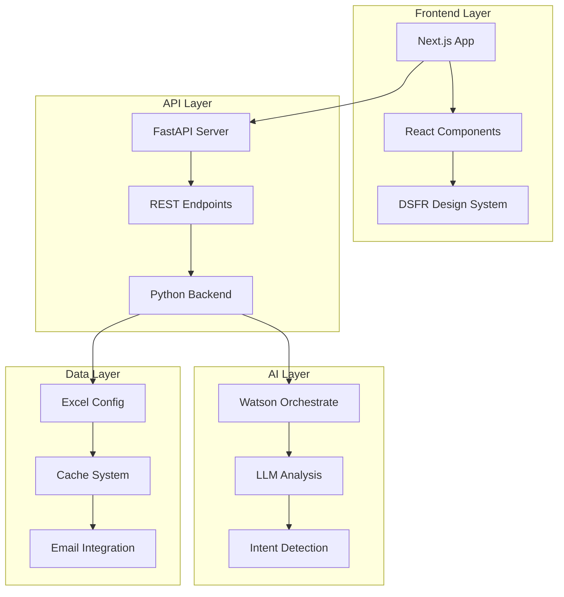

# Trusted Services - AI Platform for Public Services

[](https://nextjs.org/)
[](https://reactjs.org/)
[](https://python.org/)
[](https://fastapi.tiangolo.com/)
[](https://www.systeme-de-design.gouv.fr/)
[](https://typescriptlang.org/)

> 🏛️ **Intelligent platform for automation and improvement of French public services**

A comprehensive solution combining artificial intelligence and government design system to modernize citizen reception and request processing.

## 🚀 Project Overview

**Trusted Services** is an innovative platform that transforms the public services experience by integrating:

- **🤖 Conversational AI** with Watson Orchestrate for citizen assistance
- **📋 Automatic analysis** of requests with intent detection
- **🎨 Modern interface** compliant with DSFR (French Government Design System)
- **⚡ Optimized performance** with Next.js 15 and React 19
- **♿ RGAA accessibility** respecting government standards

### 🎯 Use Case: Yvelines Prefecture (Delphes)

The pilot project modernizes the reception of foreigners at the prefecture with:
- Intelligent appointment booking form
- Automatic processing of complex requests
- Responsive multilingual interface (FR/EN)
- Complete integration with existing systems

---

## 📋 Table of Contents

- [🚀 Quick Start](#-quick-start)
- [🏗️ Architecture](#️-architecture)
- [💻 Next.js Frontend](#-nextjs-frontend)
- [🤖 AI Integration](#-ai-integration)
- [🛠️ Installation](#️-installation)
- [⚙️ Configuration](#️-configuration)
- [🔧 API and Backend](#-api-and-backend)
- [📦 Deployment](#-deployment)
- [🌐 Localization](#-localization)
- [🔍 Debugging](#-debugging)
- [📚 Documentation](#-documentation)

---

## 🚀 Quick Start

### Full Development Mode

```bash
# 1. Clone and install
git clone <repository-url>
cd trusted-service

# 2. Python Backend
python -m venv .venv
source .venv/bin/activate  # or .venv\Scripts\activate on Windows
pip install -r requirements.txt

# 3. Next.js Frontend
cd apps/delphes/frontend
npm install

# 4. Launch in parallel
# Terminal 1 - Backend API
python launcher_api.py ./runtime

# Terminal 2 - Next.js Frontend
cd apps/delphes/frontend
npm run dev
```

🌐 **Access**:
- Frontend: http://localhost:3000
- Backend API: http://localhost:8002
- API Documentation: http://localhost:8002/docs

### Streamlit Demo Mode (Legacy)

```bash
# Integrated demo (client + server)
streamlit run launcher_testclient.py ./runtime direct

# Or REST API mode
python launcher_api.py ./runtime
streamlit run launcher_testclient.py ./runtime rest
```

---

## 🏗️ Architecture



### Project Structure

```
trusted-service/
├── 🎨 apps/delphes/frontend/     # Modern Next.js frontend
│   ├── src/app/                  # React pages and components
│   ├── public/                   # Static assets
│   └── package.json              # Node.js dependencies
├── 🔧 src/                       # Python backend
│   ├── backend/                  # FastAPI API
│   ├── client/                   # API clients
│   ├── common/                   # Shared utilities
│   └── text_analysis/            # AI engine
├── 🗃️ runtime/                   # Configuration and data
│   ├── config_*.yaml            # Server configurations
│   ├── apps/                     # Business apps (AISA, Delphes...)
│   └── cache/                    # Analysis cache
└── 📋 requirements.txt           # Python dependencies
```
---

## 💻 Next.js Frontend

### 🎨 Modern DSFR Interface

The Next.js frontend offers a modern user experience while respecting French government standards.

#### 🔧 Technologies

- **Framework**: Next.js 15.5.4 with Turbopack
- **UI Library**: React 19.1.0 with TypeScript 5.0+
- **Design System**: DSFR 1.14.2 (@gouvfr/dsfr)
- **Components**: @codegouvfr/react-dsfr 1.28.0
- **HTTP Client**: Axios 1.12.2 with SWR 2.3.6
- **Styles**: TailwindCSS 4.0+ integrated

#### 🚀 Key Features

- ✅ **Intelligent form** with real-time validation
- ✅ **AI request analysis** with automatic intent detection
- ✅ **Conditional fields** that adapt according to request type
- ✅ **Date conversion** French (DD/MM/YYYY) ↔ ISO (YYYY-MM-DD)
- ✅ **Responsive interface** optimized for mobile/desktop
- ✅ **Watson Orchestrate** integrated for AI assistance
- ✅ **RGAA accessibility** compliant with government standards
- ✅ **State management** localStorage for multi-page flows
- ✅ **API Proxy** transparent to Python backend

#### 📁 Frontend Structure

```
apps/delphes/frontend/src/
├── app/
│   ├── page.tsx                    # 🏠 Home page with redirect
│   ├── accueil-etrangers/
│   │   └── page.tsx               # 📝 Main contact form
│   ├── analysis/
│   │   └── page.tsx               # 🤖 AI analysis page with dynamic fields
│   ├── handle-case/
│   │   └── page.tsx               # 💼 Case processing + Watson Orchestrate
│   ├── confirmation/
│   │   └── page.tsx               # ✅ Confirmation page
│   ├── api/[...path]/
│   │   └── route.ts               # 🔗 API proxy to Python backend
│   ├── globals.css                # 🎨 Global DSFR styles
│   └── layout.tsx                 # 📐 Main application layout
├── components/
│   ├── ContactForm.tsx            # 📋 Reusable form component
│   ├── Header.tsx                 # 🎯 Government DSFR header
│   ├── Footer.tsx                 # 📄 Footer with useful links
│   └── Spinner.css               # ⏳ Loading animation
└── utils/
    ├── convertDateToISO.ts        # 🗓️ Date conversion FR → ISO
    └── convertISOToDate.ts        # 🗓️ Date conversion ISO → FR
```

#### 🔄 Data Flow


---

## 🤖 AI Integration

### Watson Orchestrate

The Watson Orchestrate chatbot is integrated in the `handle-case` page to provide contextual AI assistance.

#### Configuration

```typescript
// Watson configuration in handle-case/page.tsx
const wxOConfiguration = {
    orchestrationID: "0781f29958be4f588e177e1250f85e99_b50c4815-0abc-4da6-a4e0-c6371abd1ebc",
    hostURL: "https://us-south.watson-orchestrate.cloud.ibm.com",
    rootElementID: "watson-chat-container", // ⚠️ Avoids conflict with React
    deploymentPlatform: "ibmcloud",
    chatOptions: {
        agentId: "8d6b5494-1d0e-4170-aad5-a6dba46337f7"
    }
};
```

#### AI Features

- **🎯 Intent detection**: Automatic classification of requests
- **📝 Dynamic fields**: Adaptive form generation
- **🗓️ Date parsing**: Intelligent recognition of temporal formats
- **✅ Contextual validation**: Data verification according to intent
- **💬 Conversational assistance**: Real-time user support

### Backend Text Analysis

```python
# Analysis engine in src/text_analysis/
├── llm_ollama.py          # Local Ollama interface
├── llm_openai.py          # OpenAI/Azure interface
├── base_models.py         # Data models
└── text_analysis_localization.py  # Multilingual support
```

---

## 🛠️ Installation

### Prerequisites

- **Python** 3.11+ with pip
- **Node.js** 18+ with npm
- **Git** for versioning

### Backend Installation

```bash
# Python virtual environment
python -m venv .venv
source .venv/bin/activate  # Linux/macOS
# .venv\Scripts\activate   # Windows

# Python dependencies
pip install -r requirements.txt

# Verification
python -c "import fastapi, uvicorn; print('✅ Backend ready')"
```

### Frontend Installation

```bash
# Navigate to frontend
cd apps/delphes/frontend

# Install dependencies
npm install

# Verification
npm run build
echo "✅ Frontend ready"
```

### Environment Variables

Create `.env.local` in `apps/delphes/frontend/`:

```env
# API Configuration
NEXT_PUBLIC_API_BASE_URL=http://localhost:8002

# Watson Orchestrate (optional)
NEXT_PUBLIC_WATSON_ORCHESTRATION_ID=your_orchestration_id
NEXT_PUBLIC_WATSON_HOST_URL=https://us-south.watson-orchestrate.cloud.ibm.com

# Environment
NODE_ENV=development
```

---

## ⚙️ Configuration

### Runtime Configuration

The system uses YAML files for configuration:

```yaml
# runtime/config_server.yaml
server:
  host: "127.0.0.1"
  port: 8002
  reload: true

# runtime/config_connection.yaml
llm_providers:
  openai:
    api_key: "your_api_key"
    model: "gpt-4"
  ollama:
    base_url: "http://localhost:11434"
    model: "llama2"
```

### Application Configuration

Each application has its Excel configuration in `runtime/apps/`:

```
runtime/apps/
├── delphes/
│   ├── delphes.xlsx        # Business configuration
│   ├── data_enrichment.py  # Data enrichment
│   └── decision_engine.py  # Decision engine
├── AISA/
│   └── AISA.xlsx          # AISA application
└── conneXion/
    └── conneXion.xlsx     # ConneXion application
```

### Excel Structure

Excel files define:
- **Intentions**: Supported request types
- **Fields**: Required data per intention
- **Localizations**: FR/EN translations
- **Workflows**: Processing flows
- **Emails**: Notification templates

---

## 🔧 API and Backend

### FastAPI Architecture

```python
# src/backend/app.py - Main entry point
from fastapi import FastAPI
from src.backend.rest import router

app = FastAPI(
    title="Trusted Services API",
    description="API for intelligent public services",
    version="1.0.0"
)

app.include_router(router, prefix="/api")
```

### Main Endpoints

| Endpoint | Method | Description |
|----------|--------|-------------|
| `/api/analyze_request` | POST | AI analysis of a request |
| `/api/handle_case` | POST | Complete case processing |
| `/api/get_intentions` | GET | List of available intentions |
| `/api/health` | GET | API status |
| `/docs` | GET | Swagger documentation |

### Usage Examples

```bash
# Request analysis
curl -X POST "http://localhost:8002/api/analyze_request" \
  -H "Content-Type: application/json" \
  -d '{
    "app_name": "delphes",
    "locale": "fr",
    "message": "Je souhaite renouveler mon titre de séjour"
  }'

# Case processing
curl -X POST "http://localhost:8002/api/handle_case" \
  -H "Content-Type: application/json" \
  -d '{
    "app_name": "delphes",
    "locale": "fr",
    "field_values": {
      "nom": "Dupont",
      "prenom": "Jean",
      "date_naissance": "1990-01-15"
    },
    "selected_intention": "renouvellement_titre_sejour"
  }'
```

---

## 📦 Deployment

### Production Mode

```bash
# Build Frontend
cd apps/delphes/frontend
npm run build
npm run start  # Port 3000

# Backend Production
uvicorn src.backend.app:app \
  --host 0.0.0.0 \
  --port 8002 \
  --workers 4
```

### Docker (Recommended)

```dockerfile
# Dockerfile.frontend
FROM node:18-alpine
WORKDIR /app
COPY package*.json ./
RUN npm ci --only=production
COPY . .
RUN npm run build
EXPOSE 3000
CMD ["npm", "start"]
```

```dockerfile
# Dockerfile.backend
FROM python:3.11-slim
WORKDIR /app
COPY requirements.txt .
RUN pip install --no-cache-dir -r requirements.txt
COPY . .
EXPOSE 8002
CMD ["uvicorn", "src.backend.app:app", "--host", "0.0.0.0", "--port", "8002"]
```

```yaml
# docker-compose.yml
version: '3.8'
services:
  frontend:
    build:
      context: ./apps/delphes/frontend
      dockerfile: Dockerfile
    ports:
      - "3000:3000"
    environment:
      - NEXT_PUBLIC_API_BASE_URL=http://backend:8002
    depends_on:
      - backend

  backend:
    build:
      context: .
      dockerfile: Dockerfile.backend
    ports:
      - "8002:8002"
    volumes:
      - ./runtime:/app/runtime
    environment:
      - PYTHON_PATH=/app
```

### Nginx Configuration

```nginx
# /etc/nginx/sites-available/trusted-services
server {
    listen 80;
    server_name your-domain.gouv.fr;

    # Frontend Next.js
    location / {
        proxy_pass http://localhost:3000;
        proxy_set_header Host $host;
        proxy_set_header X-Real-IP $remote_addr;
    }

    # API Backend
    location /api/ {
        proxy_pass http://localhost:8002;
        proxy_set_header Host $host;
        proxy_set_header X-Real-IP $remote_addr;
    }

    # Static assets
    location /static/ {
        alias /var/www/trusted-services/static/;
        expires 1y;
        add_header Cache-Control "public, immutable";
    }
}
```

---

## 🌐 Localization

### Multilingual Support

The system currently supports:
- 🇫🇷 **French** (`fr`) - Main language
- 🇬🇧 **English** (`en`) - Complete translation

### Adding a New Language

To add support for a new language (e.g., `es` for Spanish):

#### 1. Update Python Code

```python
# src/common/configuration.py
class SupportedLocale(str, Enum):
    fr = "fr"
    en = "en"
    es = "es"  # ← Add here

# src/backend/text_analysis/text_analysis_localization.py
# IF YOU CHANGE THE FOLLOWING COMMENT, UPDATE README.md ACCORDINGLY
# Add here support for new languages
SUPPORTED_LOCALES = ["fr", "en", "es"]  # ← Add here
```

#### 2. Excel Configuration

In `runtime/apps/delphes/delphes.xlsx`:
- Duplicate `*_fr` columns to `*_es`
- Translate content with an LLM
- Keep official names without translation

#### 3. Next.js Frontend

```typescript
// src/app/layout.tsx
const locales = ['fr', 'en', 'es'];  // ← Add here

// Create translation files
// locales/es.json
{
  "contact_form": {
    "title": "Formulario de contacto",
    "submit": "Enviar"
  }
}
```

### Best Practices

- ✅ Use an LLM for translations with business context
- ✅ Keep official terms (e.g., "AES: admission exceptionnelle au séjour")
- ✅ Test each language on all user journeys
- ✅ Avoid underscores in language codes

---

## 🔍 Debugging

### Logs and Monitoring

```bash
# Detailed Backend logs
python launcher_api.py ./runtime --log-level debug

# Next.js Frontend logs
cd apps/delphes/frontend
npm run dev  # Verbose mode automatic

# Watson Orchestrate logs
# Check browser console for script errors
```

### Common Issues

#### 🚨 Error "Minified React error #321"

**Cause**: ID conflict between React and Watson Orchestrate

**Solution**: Verify that `rootElementID` in Watson config uses a unique ID (not "root")

```typescript
// ❌ Incorrect
rootElementID: "root"  // Conflicts with React

// ✅ Correct  
rootElementID: "watson-chat-container"
```

#### 🚨 CORS Error on API

**Cause**: Missing CORS configuration

**Solution**: Check FastAPI configuration

```python
# src/backend/app.py
from fastapi.middleware.cors import CORSMiddleware

app.add_middleware(
    CORSMiddleware,
    allow_origins=["http://localhost:3000"],
    allow_methods=["*"],
    allow_headers=["*"],
)
```

#### 🚨 Form fields not populated

**Cause**: Mismatch between backend/frontend field names

**Solution**: Check correspondence in `ContactForm.tsx`

```typescript
// Field name mapping
const fieldMapping = {
  'date_naissance': 'dateNaissance',
  'situation_familiale': 'situationFamiliale',
  // etc...
};
```

#### 🚨 Watson Orchestrate doesn't load

**Possible causes**:
- Script blocked by CSP policy
- Container ID not found
- Incorrect configuration

**Diagnosis**:
```javascript
// Browser console
console.log(window.wxOConfiguration);
console.log(document.getElementById('watson-chat-container'));
```

### Debug Tools

```bash
# Check service status
curl http://localhost:8002/api/health
curl http://localhost:3000/api/health

# Test API endpoints
curl -X POST http://localhost:8002/api/analyze_request \
  -H "Content-Type: application/json" \
  -d '{"app_name":"delphes","locale":"fr","message":"test"}'

# Validate configurations
python -c "
import yaml
with open('runtime/config_server.yaml') as f:
    print(yaml.safe_load(f))
"
```

---

## 📚 Documentation

### Additional Resources

- **[Frontend README](apps/delphes/frontend/README.md)** - Specific Next.js documentation
- **[Delphes README](apps/delphes/README.md)** - Business application documentation
- **[ODM README](src/backend/decision/decision_odm/README.md)** - Decision engine

### Standards and References

- **[DSFR Documentation](https://www.systeme-de-design.gouv.fr/)** - Government design system
- **[RGAA Guidelines](https://accessibilite.numerique.gouv.fr/)** - Digital accessibility
- **[Next.js Docs](https://nextjs.org/docs)** - React framework
- **[FastAPI Docs](https://fastapi.tiangolo.com/)** - Modern Python API

### External APIs

- **[Watson Orchestrate](https://www.ibm.com/cloud/watson-orchestrate)** - IBM AI platform
- **[OpenAI API](https://platform.openai.com/docs)** - Language models
- **[Ollama](https://ollama.ai/)** - Local LLM

---

## 👥 Contributing

### Git Workflow

```bash
# Create feature branch
git checkout -b feature/new-feature

# Development with atomic commits
git add .
git commit -m "feat: add function X"

# Push and Pull Request
git push origin feature/new-feature
# Create PR on GitHub
```

### Code Standards

- **Python**: Black, isort, mypy
- **TypeScript**: ESLint, Prettier
- **Commits**: [Conventional Commits](https://conventionalcommits.org/) convention

### Tests

```bash
# Backend tests
python -m pytest src/tests/

# Frontend tests  
cd apps/delphes/frontend
npm run test

# E2E tests
npm run test:e2e
```

---

## 📄 License

This project is under Athena proprietary license. All rights reserved.

---

## 📞 Support

For any questions or issues:

1. **GitHub Issues**: Create a detailed ticket
2. **Documentation**: Consult specific READMEs
3. **Logs**: Attach complete error logs
4. **Contact**: équipe-dev@athena.fr

---

*Last updated: October 3, 2025*

#### Advantages vs old static site
- **Maintainability**: Modular TypeScript code vs mixed HTML
- **Performance**: Optimized Next.js rendering vs heavy static pages  
- **UX**: Real-time validation vs server-side validation only
- **Scalability**: Reusable components vs duplicated code
- **Tests**: Testable structure vs difficult to test

For more details, see the [frontend README](apps/delphes/frontend/README.md).

## What is Trusted Services?

Trusted Services is an application server and a LOW CODE development framework that streamline the build of localizable,
accountable, self-service applications.

Trusted Services app follow a well defined flow:

- The requester is filling-in basic information in a flow
- The requester is describing his situation and need in natural language
- A **LLM-based text analyzer** is determining the intent among a list of predefined ones, and is extracting structured
  information from the natural language message
- The user is confirming the intent and extracted data
- A **rule-based decision engine** is determining the case priority and where to route the case
- A **distribution component** (e-mail, ticketing, case management) is posting the case along with insight to help the
  agent process the case

Defining a new application requires defining the application model and the decision rules:

1. The application model defines the predefined intents and the fields (such as "name", "date of application") that
   structure a case. It can be defined through an API or by configuring an Excel document. This README.md focuses on
   Excel-based approach.
2. The rules implement the following decisions:

- The (localized) messages to show to the requester
- The priority attached to a new case
- The basket where to route it
- The alerts that must be brought to the agent attention
- A recommended response that the agent can amend

------
This README shows the second approach on an example: The Delphes project (Projet de la Préfecture des Yvelines) that

- streamlines the experience of foreigners requesting services related to their stay in France
- improves the efficiency of the back-office agents in charge of processing these requests
- makes the entire chain far more trustable than the legacy email-based approach.

Applications built with the framework implement an **accountable AI pattern** with 4 major components:

- The requester
- A LLM service
- A rule-based decision service
- The back-office agent

Both the requester and the agent are "humans in the loop", as they validate AI-generated findings.
------
More details can be found in the pptx in subdirectory `docs` of the current git repository. Also, to understand the
architecture and design of the Trusted Services framework, you should check the UML diagram in
`docs/trusted_services_uml.drawio`

## Git Repository Contents

This git repository comes with:

- The source code of the Trusted Services server
- A generic Streamlit test client  
- **🆕 Modern React/Next.js frontend** for Delphes (apps/delphes/frontend/)
- Two application definition Excel files: One for the Delphes app, and one for a self-service app for a fictitious telco
  operator.

### Frontend Architecture

- **Legacy**: Static HTML website (apps/delphes/runtime/website/)
- **Modern**: React/Next.js application (apps/delphes/frontend/) 
  - Production-ready with TypeScript
  - DSFR design system compliance
  - Modular component architecture
  - API integration with existing Python backend

## Installation

### Get the Trusted Service and the sample applications

Type

```
git clone https://github.com/athena-ceo/trusted-service.git
python3.12 -m venv .venv
. .venv/bin/activate (or source .venv/scripts/Activate)
pip install -r requirements.txt
```

### 🆕 Modern frontend installation (optional)

To use the new React/Next.js interface for Delphes:

```bash
cd apps/delphes/frontend
npm install

# Development
npm run dev  # Frontend on http://localhost:3000

# Production  
npm run build
npm start
```

**Prerequisites**: Node.js 18+ and npm/yarn

### Download and install Docker Desktop and the Official IBM Operational Decision Manager for Developers image if you need to use the ODM Decision Engine

Please follow the instructions in https://hub.docker.com/r/ibmcom/odm

### Specifically for the Delphes application, download and install Thunderbird

Visit https://www.thunderbird.net/en-US/download/


## Athena Server Environment

### Connect to Athena Servers

``` 
ssh yourname@apps.athenadecisions.com
```
If you haven't changed your password, try `Athena4ever`.

Don't forget to set your env variables (OPENAI_API_KEY, SCW_PROJECT_ID, SCW_SECRET_KEY).

```
cd /data/demos/trusted-services
git pull
. .venv/bin/activate
```

### Launch the test client

```
streamlit run launcher_testclient.py ./runtime direct
```

The test client's url is `https://apps.athenadecisions.com/trusted-services-test-client/`. A shortcut is displayed on the home page: `https://apps.athenadecisions.com`.

If you would like to run Streamlit (or the server) and close your connection, use the following command:

```
nohup streamlit run launcher_testclient.py ./runtime direct > server.log 2>&1 &
```

If you would like to know if the test client (or server) is currently running:

```
ps -ef|grep streamlit
```
or
```
ps -ef|grep python
```
(Be careful, we're running Python in a shared system. Another Athenian may be running another Python process at the moment.)

## Configuration

Trusted Services apps are configured in an Excel file. For Delphes check `apps\delphes\runtime\spec_delphes_ff.xlsx` (**TO BE UPDATED**)
where fields are either self-explanatory or explained in a comment cell.

### Configure how the test client accesses the API

- The Streamlit test client can either connect to the API through function calls or through REST calls
- To configure how the test client accesses the API, switch the Excel file to tab `frontend`. Field `connection_to_api`
  has two possible values
    - `direct`: Direct access through Python function
    - `rest`: REST calls to the Uvicorn server. In that case, you will need to launch the uvicorn server (see below) and
      to configure `rest_api_host` and `rest_api_port`

### Configure what Decision Engine the API connects to

- The API either connects to ODM, Drools or a hardcoded engine (in the case of Delphes:
  `apps.delphes.src.app_delphes.CaseHandlingDecisionEngineDelphesPython`)
- To configure what Decision Engine the API connects to, switch the Excel file to tab `backend`. Field
  `decision_engine` has three possible values
    - `odm`: Connect to an ODM Decision Service. In that case, you will need to launch the ODM Docker image (see below)
      and to configure the `odm` tab
    - `drools`: Connect to a Drools Decision Service
    - `apps.delphes.design_time.src.app_delphes.CaseHandlingDecisionEngineDelphesPython`: Connect to a hardcoded
      Decision Service

## Run

Proceed in the following order:

### Option A: Modern Next.js Frontend (Recommended for Delphes)

1. **Launch Python Backend API**
   ```bash
   python launcher_api.py ./runtime
   # API available on http://localhost:8002
   ```

2. **Launch React/Next.js Frontend** 
   ```bash
   cd apps/delphes/frontend
   npm run dev
   # Frontend available on http://localhost:3000
   ```

3. **Test the application**
   - Go to http://localhost:3000
   - Use "Pre-fill form" button for quick testing
   - Verify submission works with backend API

### Option B: Traditional Streamlit Interface

If you prefer using the existing Streamlit interface:

### If you configured the Decision Engine to be ODM, launch the ODM Docker image

**Important notes**:
> **1. ODM Decision Center database persistence locale**
>
> A given instance of the ODM Decision Center database has a native locale and cannot host rules with a different
> persistence locale.
>
> To set the locale (en_US by default):
>> - launch the ODM Docker image
>> - remove all rules
>> - run `odm_dc_localization.py` in `src/backend/decision/decision_odm/admin`
>
> 3. ODM Version
     > The `-v` option in the docker command ensure the Decision Center and RES databases are backed by a file.
     > Nothing will ensure that the format of the files doesn't change. Therefore it is advised to have a directory per
     ODM version.

This leads to the following command for Delphes!

```
cd apps/delphes/runtime/odm_databases/9.0
docker run -e LICENSE=accept -m 2048M --memory-reservation 2048M -p 9060:9060 -p 9443:9443 -v .:/config/dbdata/ -e SAMPLE=false icr.io/cpopen/odm-k8s/odm:9.0
```

### Unless you only want to launch the test client, and you configured that client to access the API directly, launch the uvicorn server

In the `trusted-service` top directory, type:

```
python launcher_uvicorn.py ./apps/delphes/runtime/spec_delphes_ff.xlsx
```

### Launch the test client

In the `trusted-service` top directory, type:

```
streamlit run launcher_streamlit_direct.py apps/delphes/design_time/appdef_delphes_ff.xlsx apps/conneXion/design_time/appdef_conneXion_ff.xlsx

```

You should see a message such as:
> You can now view your Streamlit app in your browser.
> Local URL: http://localhost:8501

Click the link to launch the app in your default browser.

**Warning** If you need to run the Streamlit test client (or any other http client) on another port than 8501, update
cell `common > client_url` in the configuration xlsx file.

## Common tasks

### Defining a Trusted Services app through Excel configuration

### Adding support for a new language in the Trusted Services framework

Each language supported is identified by a string, such as "fr_FR" (French of France) or "fr" (General French, in
practice identical to fr_FR). As of today, the supported languages are: `fr` and `en`.
If you need to add support for a new language, for instance `fi` (Finnish):

- Add `fi` to the list above
- Update the Trusted Services framework Python code. To do so, look for the following comment:
    ```
    # IF YOU CHANGE THE FOLLOWING COMMENT, UPDATE README.md ACCORDINGLY
    # Add here support for new languages
    ```
  in the following files:
    - `trusted-service/src/common/configuration.py` (definition of `SupportedLocale`)
    - `trusted-service/src/backend/text_analysis/text_analysis_localization.py`
    - `trusted-service/src/sample_frontend/frontend_localization.py`
    - `trusted-service/src/sample_frontend/streamlit_main.py`

### Localizing an existing application

- First, make sure there exists support for the language in the Trusted Services framework
- Second, follow the steps below, shown on what it took to localize the Delphes app to `en`, initially supporting `fr`
  only
  This is an illustration on Delphes, which was supporting `fr` initially. Below are the steps followed to support `en`
  too
- In `./apps/delphes/runtime/spec_delphes_ff.xlsx` duplicate all rows and columns labeled `<property>_fr` and label the
  duplicate row or column `<property>_en`
- Best practices:
    - Translate the content with a LLM and give a bit of context in the prompt
    - Do not translate official names such as "AES: admission exceptionnelle au séjour", but provide extra explanation
      in English

### Best practices for localizing an existing application

- Copy-paste the configuration from a language your application already support
- Use a LLM
- No _ in locale

## Troubleshooting

- If you are not receiving the emails as you would expect, check `send_email` in tab `email_configuration` of the Excel
  Configuration File
- If you get an empty page on the test client, make sure the left-hand side panel is open
